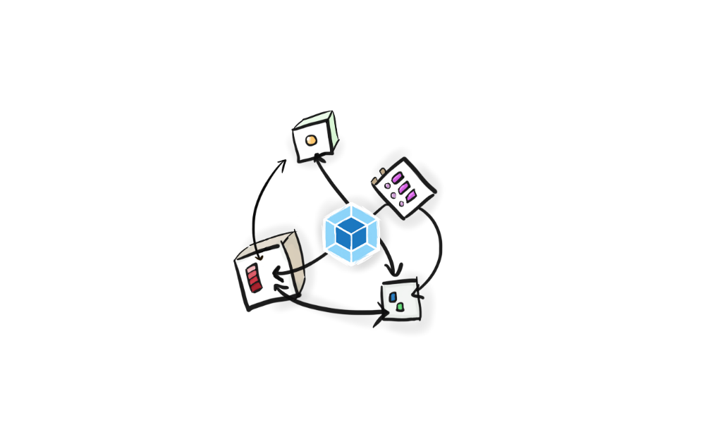

# POC Micro-Frontend

<h1 align="center">
    
</h1>

In this repository you'll find a case study of an app using the concepts of [Module Federation](https://webpack.js.org/concepts/module-federation/) (Webpack 5) with [React](https://reactjs.org/) and using [react-router-dom](https://reactrouter.com/) to manage the routing.

## :gear: Build Setup

You need run these commands in the directories in a different terminal window for each app:

```bash
yarn && yarn start
```

Tip: For the server you can run the app in develop mode:

```bash
yarn && yarn start:dev

```

## :microscopes: Tests

You have the choice to use two types of test. The unity test methodology or the end-to-end methodology. _I have added some simple examples in how to work on with them_.

### To run with [Jest](https://jestjs.io/)

```bash
cd home && yarn start
```

### To run with [Cypress](https://www.cypress.io/)

```bash
cd home && yarn run cypress open
```

## :man_technologist: About the author


:wolf:&nbsp; Find me!

[](https://www.linkedin.com/in/joaopaulo80/)
[](mailto:jpfricks@gmail.com)

<small>"If at first the idea is not absurd, then there is no hope for it." – Albert Einstein</small>

## :memo: License

This project is under the MIT license. See the [LICENSE](LICENSE.md) file for more details.

---

Made with :purple_heart:&nbsp; by João Paulo Fricks
